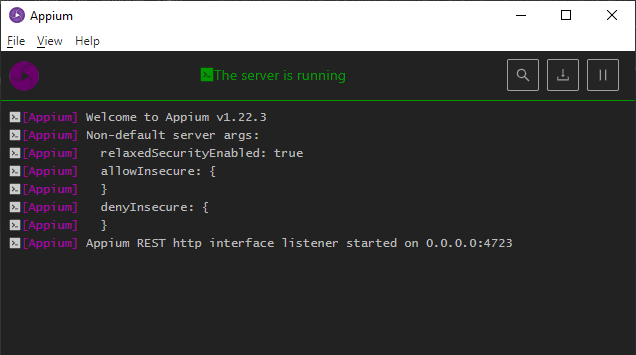
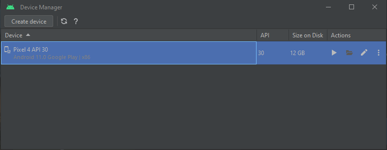

# Проект по автоматизации тестирования мобильного приложения wikipedia

### Технологии и инструменты:
<p align="center">


</p>

Тесты написаны на языке программирования <code>Java</code> с использованием фреймворков <code>JUnit 5</code> и <code>Selenide</code>, а также паттерна Page Object. 
Для автоматизированной сборки проекта используется <code>Gradle</code>.
Конфигурация запуска реализована с использованием техноголии <code>Owner</code> для запуска тестов в зависимости от параметров сборки.
В проекте подключено логгирование с помощью аннотаций <code>Allure</code>, после прохождения тестов формируется Allure-отчет, который может быть использован в качестве тестовой документации.

### Реализованные проверки:
* Позитивные:
  * Проверка прохождения начального экрана
  * Проверка поиска в приложении
* Негативные: 
  * Проверка неуспешной авторизации с рандомными данными, генерируемыми с использованием библиотеки [javafaker](https://github.com/DiUS/java-faker) 


### Запуск автотестов:

Для запуска автотестов необходимо запустить:
1. Appium Server GUI
<p align="center">

</p>

2. Эмулятор с помощью Android Studio Device Manager
<p align="center">

</p>

#### Локальный запуск позитивных тестов из терминала:
```bash
gradle clean positive_test 
```

#### Локальный запуск негативных тестов из терминала:
```bash
gradle clean negative_test 
```

### Отчет Allure report
#### Локальное формирование отчета Allure
```bash
gradle allureServe 
```
#### Основная страница отчета
<p align="center">

</p>

#### Тест-кейсы
<p align="center">

</p>
